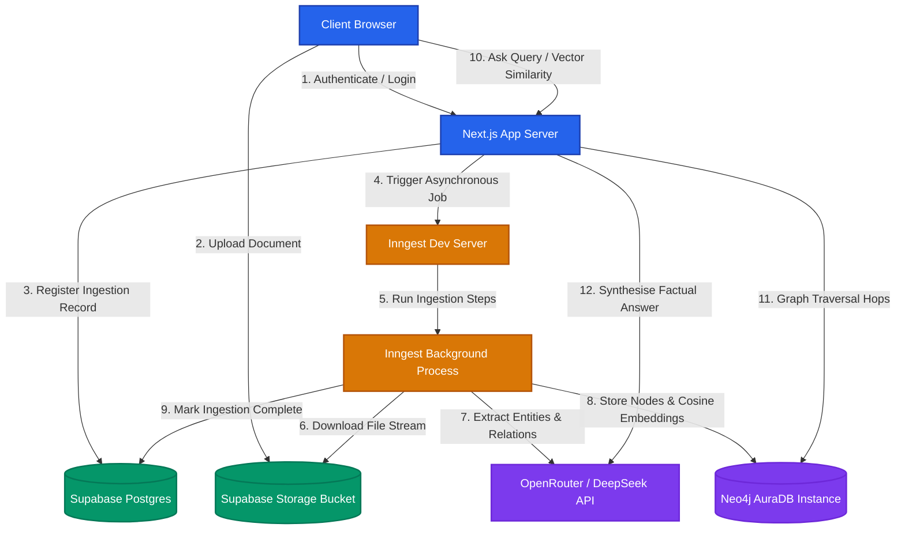

# 🛠️ GraphWarp Developer Setup & Installation Guide

Welcome to **GraphWarp**! This document provides a highly visual, step-by-step guide to installing, configuring, and launching the full-stack GraphRAG engine locally.

---

## 1. System Architecture Graph

This diagram shows how the client, Next.js app, Supabase, Inngest, OpenRouter, and Neo4j AuraDB coordinate during document parsing and querying:



---

## 2. Installation Roadmap Graph

Follow this logical path to set up your keys, apply migrations, and boot the servers:

```mermaid
graph LR
    classDef step fill:#f3f4f6,stroke:#d1d5db,color:#1f2937,stroke-width:1px;
    classDef active fill:#2563eb,stroke:#1e40af,color:#ffffff,stroke-width:2px;

    S1[1. Clone Repo]:::step --> S2[2. Set Up Supabase Auth & Storage]:::step
    S2 --> S3[3. Start Neo4j AuraDB Free Instance]:::step
    S3 --> S4[4. Get OpenRouter & Inngest Keys]:::step
    S4 --> S5[5. Configure .env.local]:::active
    S5 --> S6[6. Run SQL Migrations]:::step
    S6 --> S7[7. Launch Web & Inngest dev]:::active
```



---

## 3. Step-by-Step Setup Instructions

### 📥 Step 1: Clone the Repository & Install Dependencies
First, clone your repository and navigate to the Next.js `web` workspace folder:
```bash
cd D:/Graph/web
npm install
```

### ☁️ Step 2: Launch Your Database instances
1. **Supabase (Auth & Database)**:
   - Go to [Supabase](https://supabase.com) and spin up a new free project.
   - Go to **Project Settings $\rightarrow$ API** and copy your `Project URL` and `anon public key`.
   - Go to **Storage $\rightarrow$ Buckets** and create a new private bucket named `documents` (without any folder prefix).
2. **Neo4j AuraDB (Graph Web & Vectors)**:
   - Go to [Neo4j Aura Console](https://console.neo4j.io) and launch a new **free instance**.
   - Save the downloaded credentials containing your `NEO4J_URI`, `NEO4J_USERNAME` (`neo4j`), and `NEO4J_PASSWORD`.
3. **OpenRouter (AI Orchestrator)**:
   - Go to [OpenRouter](https://openrouter.ai) and generate an API key. 
   - Ensure your account has sufficient credits (or uses free models).
4. **Inngest (Asynchronous Worker)**:
   - Inngest runs locally without keys for development, but you will need an account at [Inngest](https://inngest.com) for production.

### 🔑 Step 3: Configure Environment Variables
Create a `.env.local` file inside the `web` directory:
```bash
# web/.env.local
```
Fill it with the credentials gathered above:
```env
# ── SUPABASE (Auth & Storage) ────────────────────────────────────────────────
NEXT_PUBLIC_SUPABASE_URL=https://your-project-id.supabase.co
NEXT_PUBLIC_SUPABASE_ANON_KEY=eyJhbGciOiJIUzI1NiIsInR5cCI6IkpXVCJ9...
SUPABASE_SERVICE_ROLE_KEY=eyJhbGciOiJIUzI1NiIsInR5cCI6IkpXVCJ9...

# ── NEO4J AURADB (Graph & Vector Search) ──────────────────────────────────────
NEO4J_URI=neo4j+s://your-instance-id.databases.neo4j.io
NEO4J_USERNAME=neo4j
NEO4J_PASSWORD=your_secure_password

# ── OPENROUTER (DeepSeek & Vision API) ───────────────────────────────────────
OPENROUTER_API_KEY=sk-or-v1-your_openrouter_api_key

# ── OPENAI / PLUGGABLE EMBEDDINGS (Cosine Vector Search) ──────────────────────
# Optional: Set this to enable vector similarity search (Step C)
OPENAI_API_KEY=sk-proj-your_openai_api_key
# Optional custom embedding configurations:
# EMBEDDING_API_BASE_URL=https://api.openai.com/v1
# EMBEDDING_MODEL=text-embedding-3-small
# EMBEDDING_DIMENSIONS=768
```

### ⚡ Step 4: Apply Database Migrations
To set up your Postgres schemas, Row-Level Security (RLS) policies, and foreign keys:
1. Go to your **Supabase Dashboard $\rightarrow$ SQL Editor**.
2. Click **New Query**.
3. Copy the contents of the hardening migration: [20260524054902_db_hardening.sql](file:///d:/Graph/supabase/migrations/20260524054902_db_hardening.sql) and the initial schema [00001_init_schema.sql](file:///d:/Graph/supabase/migrations/00001_init_schema.sql).
4. Run the query. Your PostgreSQL tables, storage permissions, and security constraints are now fully configured.

---

## 4. Running the Development Stack

To run the application locally, you must launch **both** the Next.js development server and the Inngest local background worker.

### Terminal 1: Launch Next.js
In the `/web` directory, start the Next.js compilation server:
```bash
npm run dev
```
*Your frontend will be accessible at [http://localhost:3000](http://localhost:3000).*

### Terminal 2: Launch Inngest Developer Console
In the `/web` directory, launch the Inngest CLI tool:
```bash
npx inngest-cli@latest dev
```
*The Inngest developer dashboard will be accessible at [http://localhost:8288](http://localhost:8288), allowing you to audit, step-through, and replay document extraction pipelines.*
